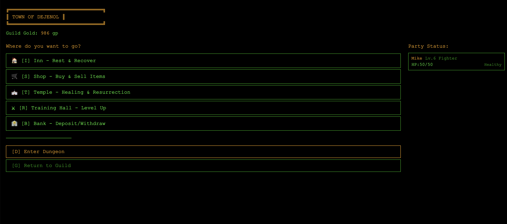
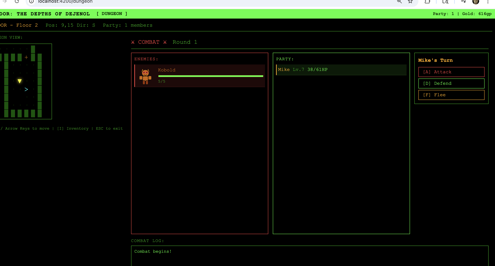
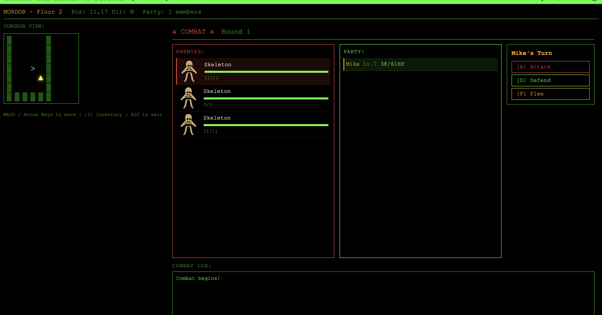
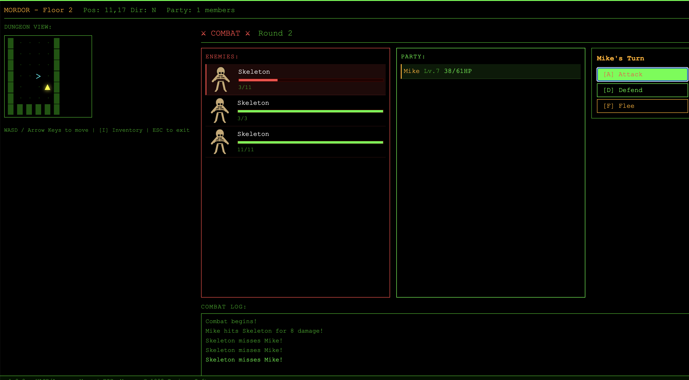
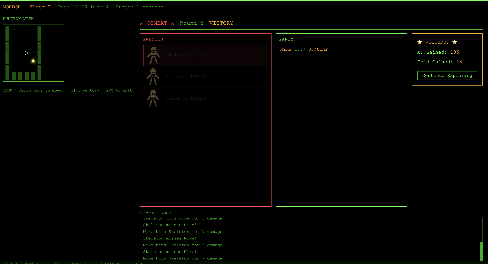
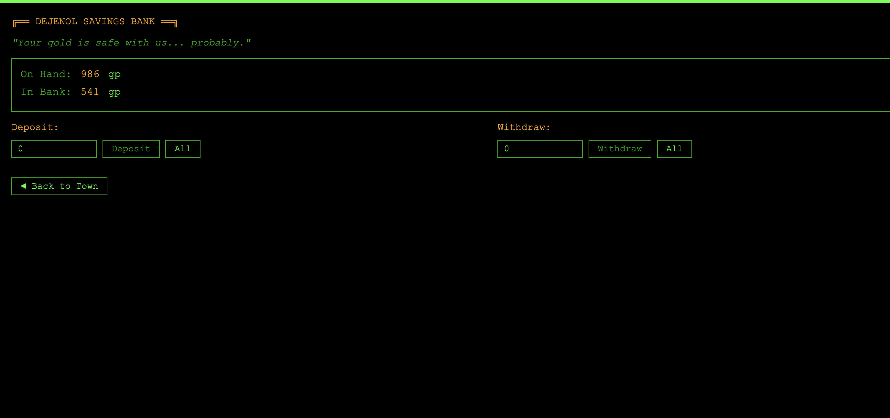

# Mordor — The Depths of Dejenol

> A retro DOS-style dungeon crawler RPG built with Angular. Explore procedurally generated dungeons, fight monsters, manage your party, and delve ever deeper into the depths.

---

## Screenshots

### 🏰 Town of Dejenol


### ⚔️ Combat — Fighting a Kobold


### 💀 Combat — Three Skeletons (Round 1)


### ⚡ Combat — Round 2 with Combat Log


### 🏆 Victory Screen with Loot


### 🏦 Dejenol Savings Bank


---

## Features

- **Procedurally generated dungeons** — Rooms, corridors, doors, traps, and chests on every floor
- **Turn-based combat** — Attack, defend, cast spells, or flee; enemies counter-attack each round
- **Party system** — Build and manage a guild of adventurers across multiple classes and races
- **Town of Dejenol** — Inn, Shop, Temple, Training Hall, Bank, and Library
- **Monster Library** — Look up lore and stats on creatures found in the upper floors
- **Minimap exploration** — Fog-of-war map that reveals as you explore
- **Keyboard-driven** — Full keyboard shortcuts across every screen
- **DOS aesthetic** — Green-on-black terminal UI inspired by the original Mordor (1995)

## Keyboard Shortcuts

| Screen | Key | Action |
|--------|-----|--------|
| Town | `I` | Inn |
| Town | `S` | Shop |
| Town | `T` | Temple |
| Town | `R` | Training Hall |
| Town | `B` | Bank |
| Town | `L` | Library |
| Town | `D` | Enter Dungeon |
| Dungeon | `WASD` / Arrows | Move |
| Dungeon | `>` or `.` | Descend stairs |
| Dungeon | `<` or `,` | Ascend stairs |
| Dungeon | `I` | Open Inventory |
| Combat | `A` | Attack |
| Combat | `D` | Defend |
| Combat | `F` | Flee |
| Combat | `S` | Spells |
| Anywhere | `Esc` | Back / Cancel |

---

## Getting Started

```bash
npm install
ng serve
```

Then open [http://localhost:4200](http://localhost:4200).

## Build

```bash
ng build
```

Output goes to `dist/mordor/`.

